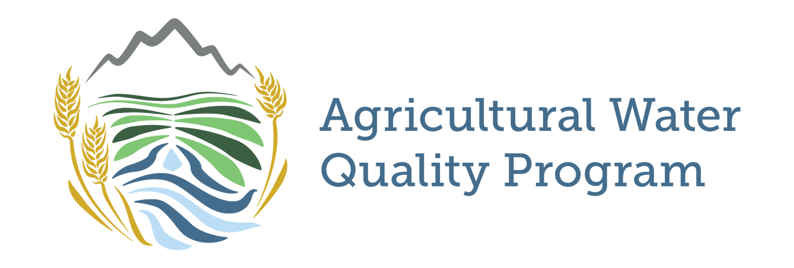

# ALS Data Cleaning Tool
A coding tool developed in R to take water analysis results exported from the [ALS WEBTRIEVE™ data portal](https://webtrieveus.alsenviro.com/Login.aspx). Exported data are cleaned, merged, and exported into archiving (e.g., CSV) or visual (e.g., HTML) formats. The tool also merges data produced in-house (i.e., pH, Total Suspended Soilds, and Specific Electrical Conductivity) with the final exported data. **Before using, please see the [data disclosure statement](#data-disclosure-statement-for-als-data-cleaning-tool) below.**

__Created By:__

**A.J. Brown**  
*Agricultural Data Scientist*  
CSU Agricultural Water Quality Program  
[Ansley.Brown@colostate.edu](mailto:Ansley.Brown@colostate.edu)

and

**Molly "Caz" Bell**  
*Former AWQP Student Research Assitant*  

---
## Table of Contents
- [Repo Contents](#repo-contents)
- [Some Helpful Troubleshooting Notes](#some-helpful-troubleshooting-notes)
- [Future Developments](#future-developments)
- [Data Disclosure Statement for ALS-Data-Cleaning-Tool](#data-disclosure-statement-for-als-data-cleaning-tool)
---

## <u>Repo Contents</u>
* **Code**
    * **file-merger.R** - a script that takes the raw files from ALS, cleans the data, and exports as a dataframe and/or CSV file for other uses
    * **site_selector.Rmd** - a markdown script that produces an HTML report with interactive data visualization and optional data export for a specific research site location as chosen by the user
    * **water_report.Rmd** - a markdown script that produces a summary of all water quality data for all sites on a YTD basis
* **Data**
    * a folder containing example data to use in script execution ([please see data disclosure statement](#data-disclosure-statement-for-als-data-cleaning-tool)).
* **figures**
    * a folder containing the AWQP logo for use in this README.
* **Report**
    * a folder containing the resulting HMTL report that result from execution of the "water_report.Rmd" script.
    * *Please note* that this is not where the HTML report is generated, but rather where it was moved after generation. It is currently generated in the Code folder, which is an ongoing bug to be addressed at a later time.
* **site_selector_temporary_results**
    * a folder containing the resulting HMTL report and CSV file that result from execution of the "site_selector.Rmd" script.
    * *Please note* that this is not where the HTML report is generated, but rather where it was moved after generation. It is currently generated in the Code folder, which is an ongoing bug to be addressed at a later time. **The CSV**, however, *is* generated in this folder upon execution.
* **TSS**
    * a separate folder where an excel file exists containing example total suspended solids, electrical conductivity, and pH data is stored in the format congruent with what AWQP staff use in-house.  It is in a separate folder because this mimics the true deployment of this code outside of the github repo.
* **ALS_Data_Cleaning_Tool.Rproj**
    * the R project file used to open the codebase into the correct directory for Rstudio.  Double click this file to begin using the coding tool in Rstudio.
* **AWQP Water Processing ID Key 2023**
    * a separate excel file that details the ID protocols used to label each water sample, that is the basis for this codebase to dissect information back into a more useable format.
## <u>Some Helpful Troubleshooting Notes</u>

* Currently, the output HTML reports get generated in the /Code folder and need to be moved manually to other locations (in this case "Reports" or "site_selector_temporary_results").

* ALS exports data as ".xls" file format in name only.  The actual result files are in ".htm" format.  The sample metadata, however is actually in ".xls" format, as found on the "samples" tab.

* If you edit the .htm file from ALS in excel and save it, it corrupts the file and cannot then be imported.  This occurred for us once when we tried to edit an erroneous date.

* When running file-merger.R, which occurs in all the markdown scripts, you CANNOT have the TSS excel file open, else an error will occur

* It is helpful to create a "Confidential Data" forlder in the repo you fork, to run the code locally with real data.  This avoids copy/pasting the entire repo elsewhere to operate it.

## <u>Future Developments</u>
* Overall
    * Automate the emailing of the report(s) after generation
    * fix the issue with HTML reports being saved in /Code folder
    * ~~Create confidential data folder to run using real ALS data~~
    * ~~create confidential TSS folder to run using real data~~
* file-merger
    * Add integration of separate excel file results when ALS Houston exports work to other ALS labs (e.g., when Selenium analysis is requested.)
    * Fix sample hold time flag "H" in flagData funciton in file_merger.R
    * Add GPS coordinates dictionary to assign coordinates to each location and treatment (as necessary)
* water_report
    * Create table of methods used in introduction
    * See if we can parse Kerbel results by treatment
    * fix Kerbel inflow/outflow not being colorized properly
* site_selector
    * Create table of methods used in introduction
    * Set the plotly plots to start at the correct y range
    * Fix scatter plotly plot points for Point Sample on the violin plot
    * Potentially create a way to run the functions for multiple sites
    * Add histograms and correlations to scatterplot matrix
    * Put analyte labels outside of the scatterplot matrix and shorten their names with a analyte dict. 
    * ~~Fix mutate error in scatterplot matrix~~

---

# Data Disclosure Statement for ALS-Data-Cleaning-Tool

## 1. Purpose and Scope

This Data Disclosure Statement ("Statement") applies to all data contained within the **ALS-Data-Cleaning-Tool** repository hosted on GitHub (the "Repository"). The Statement's intent is to clarify the purpose, limitations, and appropriate usage of the data shared in the Repository.

## 2. Data Usage

The data provided in this Repository is for **example purposes only**. Users are explicitly discouraged from interpreting, sharing, or using this data for applications other than illustrative or educational examples related to the Repository's described purposes.

## 3. Limitations

The data in this Repository:

- Has not been controlled, verified, or vetted for use as final data in any application, project, or production environment.
- May not be complete, accurate, or representative of real-world scenarios.
- May contain inaccuracies or errors that could affect its utility or interpretation.

## 4. No Warranty

The data is provided "as is" without any warranties, either express or implied. The maintainers of **ALS-Data-Cleaning-Tool** make no representations or warranties about the suitability of this data for any purpose. Use at your own risk.

## 5. Restrictions

Users are prohibited from:

- Claiming the data as their own original work.
- Using the data for commercial purposes without prior written permission.
- Distributing or sharing the data without including this Data Disclosure Statement.

## 6. Liability

The maintainers of **ALS-Data-Cleaning-Tool**, contributors, or any affiliated parties shall not be held liable for any direct, indirect, incidental, special, exemplary, or consequential damages (including, but not limited to, procurement of substitute goods or services; loss of use, data, or profits; or business interruption) arising from the use or inability to use the data.

## 7. Acknowledgement

Users who reference or cite the Repository or its data in any public forums, publications, presentations, or similar mediums should acknowledge the source and include a link to the original Repository and this Data Disclosure Statement.

---

By accessing, downloading, or using the data, you acknowledge that you have read, understood, and agreed to comply with the terms outlined in this Data Disclosure Statement.

For any questions or clarifications regarding this statement or the data provided, please contact:

**A.J. Brown**  
*Agricultural Data Scientist*  
Colorado State University Agricultural Water Quality Program  
[Ansley.Brown@colostate.edu](mailto:Ansley.Brown@colostate.edu)